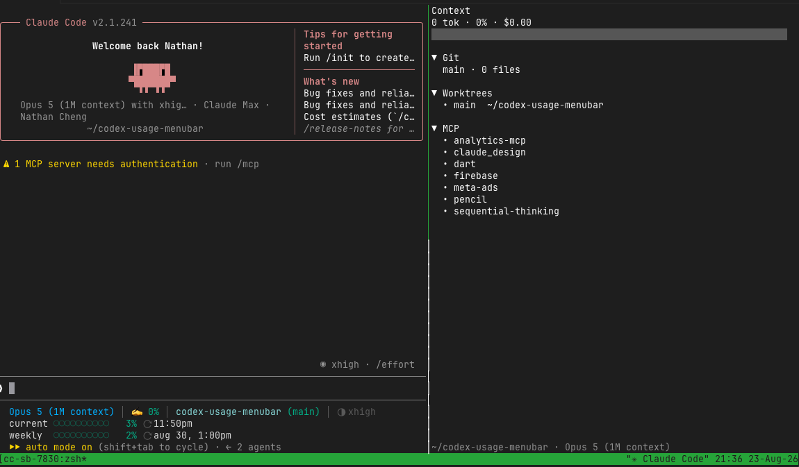
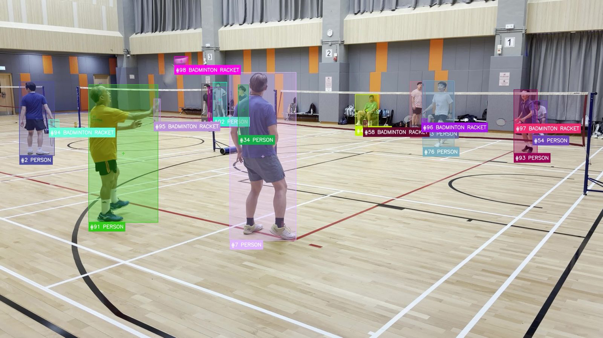

  

  

  
  
  
  

## About Me

I am a full-stack developer and technology enthusiast who enjoys turning an idea into a complete working product. I move across product thinking, UX, frontend, backend, data, automation, deployment, and iteration—whatever the problem needs.

I am always exploring new platforms, AI-assisted development, mobile and hardware integrations, and better ways to build. My public projects include setup steps, validation commands, limitations, and security notes so the engineering decisions remain inspectable.

## From Idea to Product

  <strong>Discover</strong> &nbsp;→&nbsp; <strong>Shape</strong> &nbsp;→&nbsp; <strong>Design</strong> &nbsp;→&nbsp; <strong>Build</strong> &nbsp;→&nbsp; <strong>Ship</strong> &nbsp;→&nbsp; <strong>Learn</strong>

| Focus | What that means in practice |
|---|---|
| End-to-end products | Product discovery, UX, architecture, implementation, deployment, and continuous improvement |
| Web, backend, and data | Responsive interfaces, APIs, source-backed content, automation, and reliable data flows |
| Mobile and hardware | Flutter, iOS/Android integration, BLE, physical-device validation, and resilient local state |
| Developer productivity | Native macOS and terminal tools that make AI-assisted work more observable and controllable |

## Tech Stack

  

## GitHub Snapshot

  
  

## Project Spotlights

### Claude Sidebar

  

A real tmux session with Claude Code on the left and the read-only sidebar on the right. The panel keeps context usage, Git state, worktrees, configured MCP servers, touched files, todos, and the latest diff visible without modifying the coding session.

[**Explore the repository →**](https://github.com/nathan1658/claude-sidebar)

### Badminton Video Analysis

  

An interactive, video-first doubles badminton analysis workspace combining synchronized playback, manual court calibration, player movement trails, sparse shuttle evidence, rally events, and score state. The screenshot shows the raw detection and tracking evidence; reviewed identities and scoring remain explicit rather than being presented as automatic facts.

[**Explore the repository →**](https://github.com/nathan1658/badminton-video-analysis)

## Featured Projects

  
  

  
  

  
  

### Evidence Behind the Work

- **Tested developer tooling:** `claude-sidebar` documents 126 dependency-free tests; `codex-usage-menubar` includes parser and normalization tests.
- **Products you can use:** [J-Pop HK Concerts](https://jpop-hk-concerts.web.app/) and [HK Horse Memory](https://hk-horse-memory-nc.web.app/) are live.
- **Real-device engineering:** Eddystone Playground documents Android/iOS capability boundaries, diagnostics, screenshots, and physical-device validation.
- **Security-conscious backend work:** whatsmeow-playground documents Host, Origin, content-type, XSS, and local credential-storage safeguards.

## How I Work

- Own the whole journey from idea to deployment, then keep improving from real feedback.
- Trace the real data path from source payload to rendered behavior.
- Treat privacy, failure modes, and operational limits as product requirements.
- Make uncertainty visible instead of presenting guesses as facts.
- Prefer small, verifiable releases with useful documentation and honest validation boundaries.

## Contribution Activity

  

<strong>More public experiments</strong>

- [Design Tools](https://github.com/nathan1658/design-tools) — reusable skills for editable presentations and visual production.
- [Video Publish Automation](https://github.com/nathan1658/video-publish-automation) — a small Python workflow for moving selected videos and publishing them to YouTube.

  <strong>Build clearly. Verify honestly. Leave a useful trail.</strong>

  

